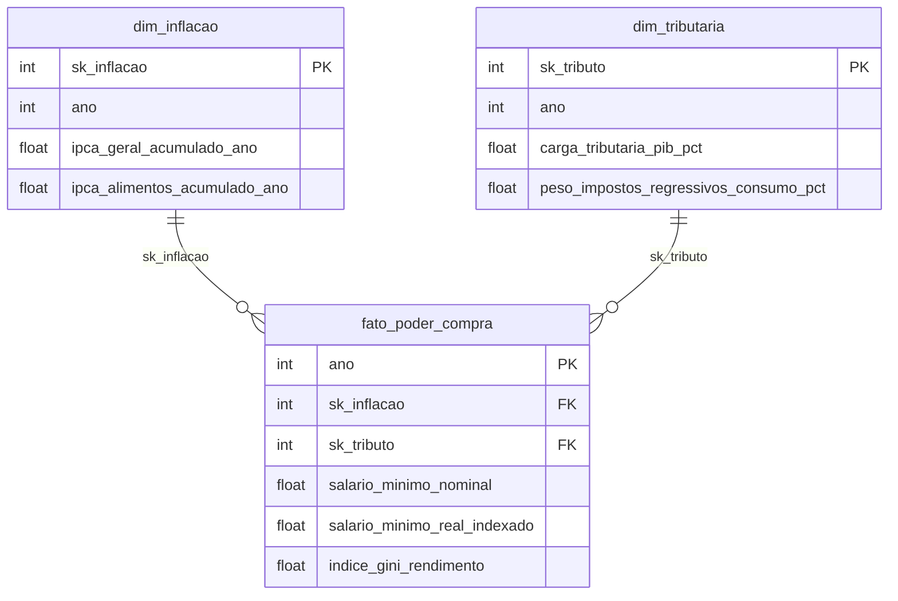
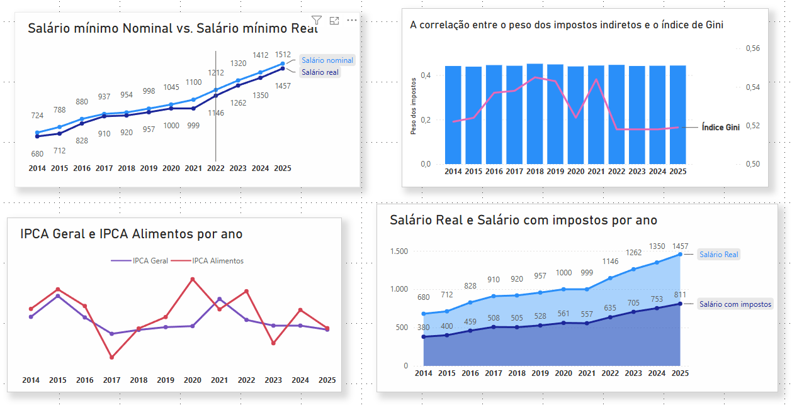

# 📺 Episódio 1: O Custo de Reprodução da Força de Trabalho (2014-2025)

## 📌 Visão Geral da Análise
Este episódio investiga a dinâmica do poder de compra real da classe trabalhadora brasileira ao longo da última década (2014 a 2025). Sob uma perspectiva da economia política materialista, o objetivo é demonstrar como o ganho nominal do salário mínimo é sistematicamente tensionado por duas forças estruturais: a inflação de subsistência (IPCA Alimentos) e o caráter regressivo da carga tributária nacional sobre o consumo.

---

## 📐 O Modelo Star Schema (Camada Processada)
Para garantir a otimização das consultas no Power BI, a modelagem dimensional foi normalizada na camada `processed` do pipeline em Python. As dimensões filtram a tabela fato exclusivamente através de chaves substitutas (*Surrogate Keys*):

## 🧠 Métrica DAX Estratégica: 
Salário Líquido de SubsistênciaPara calcular a expropriação tributária real sofrida pelo trabalhador de baixa renda (cuja propensão marginal a consumir é próxima de 100%), foi desenvolvida a seguinte medida para extrair o imposto indireto sobre o salário real deflacionado:

### Salario_Liquido_Subsistencia = SUM(fato_poder_compra[salario_minimo_real_indexado]) * (1 - (SUM(dim_tributaria[peso_impostos_regressivos_consumo_pct]) / 100))

## 📊 Relatório de Insights Estruturais

### 1. A Ilusão do Ganho Nominal vs. Corrosão Inflacionária
*   **Análise do Visual:** O primeiro gráfico expõe o distanciamento histórico entre o **Salário Mínimo Nominal** e o **Salário Mínimo Real** (deflacionado). 
*   **Insight Crítico:** Fica evidente que até 2020 a diferença mantinha um padrão linear. Contudo, a partir de **2021 (impacto agudo da pandemia)**, o hiato entre as duas linhas explode, superando a marca de R$ 100,00 de diferença. Isso prova que reajustes nominais sem política ativa de valorização real servem apenas como um anestésico temporário contra a inflação que já corroeu o bolso no período anterior.

### 2. A Carestia de Vida: Inflação de Subsistência
*   **Análise do Visual:** O gráfico de linhas do IPCA cruza a taxa oficial média (IPCA Geral) com o indicador específico de Alimentos e Bebidas ao longo do período histórico.
*   **Insight Crítico:** Ao contrário de uma correlação linear constante, o comportamento dos preços de subsistência é volátil e sujeito a choques específicos de oferta. Fica evidente que o grande descolamento ocorre no **biênio pandêmico (2020-2021)**, onde a inflação de alimentos (vermelha) disparou agressivamente acima do índice geral. Contudo, o gráfico também revela o oposto em períodos de recuperação: em **2017**, após a severa recessão anterior, a linha de alimentos despencou drasticamente abaixo do IPCA geral (efeito de safras recordes), assim como voltou a cruzar de forma descendente em **2023**. Os picos secundários em **2022** e **2024** sugerem dinâmicas locais e sazonais, reforçando que não se pode afirmar causalidade direta simplista, mas sim apontar como momentos de anomalias na cadeia de suprimentos (como a pandemia) penalizam de forma desproporcional o consumo básico.

### 3. A Crônica da Desigualdade e Regressividade Tributária
*   **Análise do Visual:** O gráfico de eixos duplos correlaciona as barras do peso dos impostos sobre o consumo com as oscilações do Índice de Gini.
*   **Insight Crítico:** Enquanto o **peso dos impostos indiretos sobre o consumo permanece petrificado e crônico na casa dos 44%** de toda a arrecadação do país, o Índice de Gini (desigualdade) flutua de forma volátil. O Gini cresce até o pico de 2018, sofre picos de piora durante a pandemia (2020-2021) e mostra uma leve estabilização entre 2022 e 2025. A imutabilidade das barras tributárias prova que o sistema fiscal brasileiro reproduz a desigualdade de classes ao taxar intensamente o consumo em vez da renda e da grande propriedade.

### 4. O Valor Expropriado: O Salário Líquido de Subsistência
*   **Análise do Visual:** O gráfico de áreas preenchidas projeta o impacto final combinado da inflação e dos tributos regressivos sobre a força de trabalho.
*   **Insight Crítico:** A área sombreada escura representa graficamente a **fatia do poder de compra real que é tirada do trabalhador antes mesmo que ele consiga adquirir suas mercadorias básicas**. A tendência de crescimento e o distanciamento sistemático das linhas a cada ano revelam que o "sufoco" financeiro das famílias não é um acidente de percurso, mas uma característica estrutural: o trabalhador gasta cada vez mais tempo de sua jornada de trabalho apenas para cobrir a regressividade do sistema.

---

## 🏛️ Tomada de Decisão Baseada em Evidências (Recomendações)

> ⚠️ **Nota Metodológica Importante:** As propostas a seguir constituem caminhos de intervenção desenhados estritamente a partir das correlações observadas nos dados históricos (2014-2025), operando como hipóteses de formulação de políticas públicas e não como relações determinísticas de causa e efeito.

Com base nos gargalos estruturais identificados nas análises, o planejamento econômico focado na preservação da força de trabalho deve priorizar as seguintes decisões:

### 1. Implementação de "Cashback Tributário" para Baixa Renda (Foco na Cesta Básica)
*   **O Dado de Origem:** A constância de **44%** de peso dos impostos sobre o consumo na `dim_tributaria` asfixia a base econômica do país.
*   **A Decisão:** Priorizar o desenho de um sistema de devolução automática de impostos (Cashback) para famílias cadastradas no CadÚnico. Retornar o imposto incidente sobre a cesta básica e tarifas de consumo essencial (luz, água) ataca diretamente o "vão" do gráfico de áreas, injetando poder de compra direto na base sem gerar renúncias fiscais genéricas e ineficientes.

### 2. Gatilho Emergencial de Valorização Real do Salário Mínimo
*   **O Dado de Origem:** No primeiro gráfico, a divergência nominal vs. real explode em **2021** (diferença maior que R$ 100,00) devido a choques rápidos na cadeia de suprimentos.
*   **A Decisão:** Implementar um **Gatilho Inflacionário Protetivo** na regra de valorização do salário mínimo. Caso o IPCA acumulado quadrimestral ultrapasse um teto de segurança, o reajuste do salário mínimo deve ser antecipado proporcionalmente para evitar que a força de trabalho carregue o prejuízo da inflação acumulada até o final do ano civil.

### 3. Política de Estoques Reguladores para Combater a Carestia de Alimentos
*   **O Dado de Origem:** O gráfico 2 mostra que a inflação de **Alimentos e Bebidas** atinge picos muito superiores ao IPCA Geral nos momentos de crise (2015 e 2020), atacando a segurança alimentar.
*   **A Decisão:** Financiar a retomada de estoques reguladores públicos (via CONAB) para alimentos essenciais (arroz, feijão e milho). O State deve intervir vendendo estoques estrategicamente abaixo do preço de mercado durante choques inflacionários na cadeia produtiva, quebrando artificialmente a curva de alta e forçando a linha vermelha do gráfico a convergir de volta à estabilidade.

---

## 📈 Conclusão do Portfólio
O projeto cumpre com sucesso a função de transformar dados macroeconômicos áridos em uma narrativa visual contundente. Tecnicamente, demonstra maturidade na aplicação de boas práticas de BI (Star Schema, tratamento de anomalias numéricas com Pandas e otimização de eixos analíticos no Power BI). Politicamente, expõe de forma quantitativa que o custo de reprodução da força de trabalho no Brasil é severamente penalizado por escolhas de política fiscal e monetária que sobrecarregam a base da pirâmide social.

---
*Desenvolvido por **Patrick Carvalho Souza**.*

